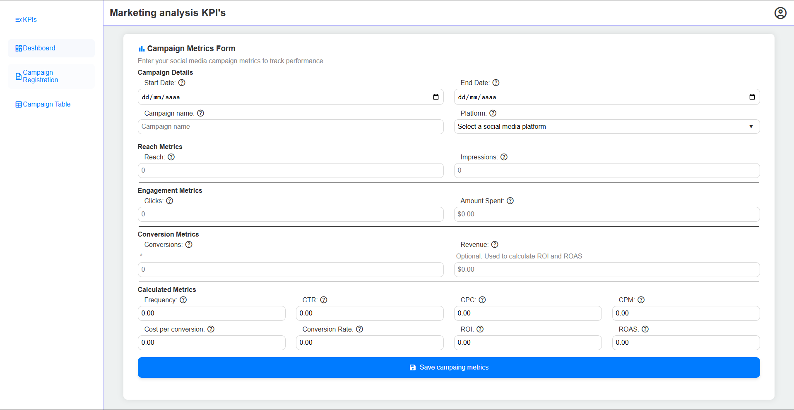
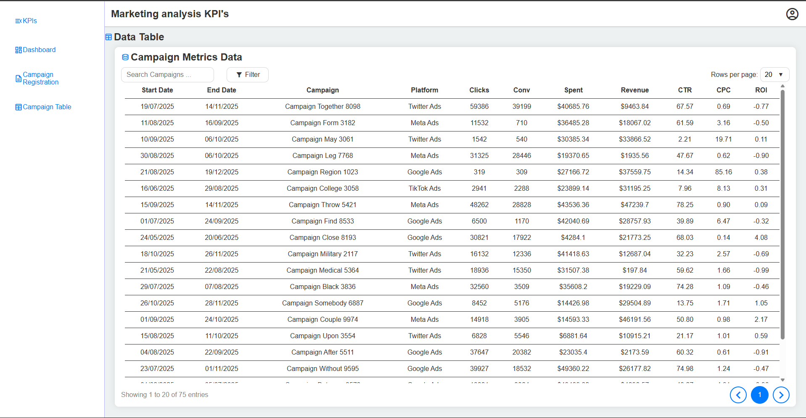
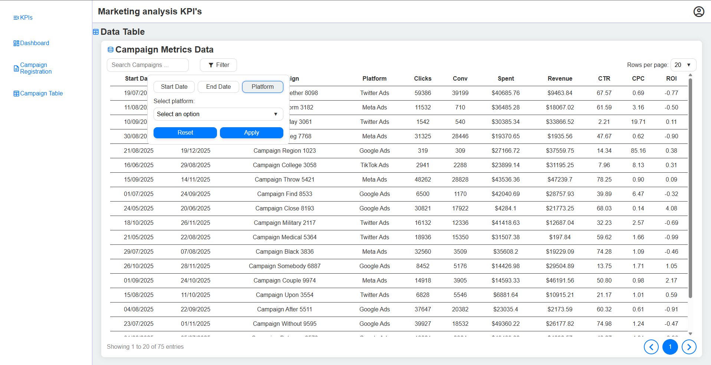
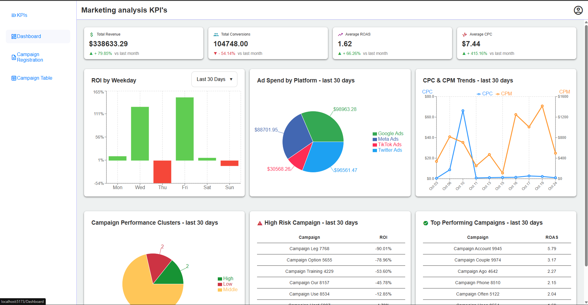

# Marketing analysis - Portfolio Project

This project represents a **significant portion of the work and skills acquired during my professional internship** as a Junior Data Analyst at **NeuroMarket**.

This project is a specialized web application developed to track, register, and visualize the performance of social media campaigns.
I contributed to both backend and frontend development, focusing on data processing, visualization, and user interaction.

## Backend work

I implemented data processing pipelines to transform raw campaign metrics into structured datasets used for dashboard visualizations. The original data was extracted from a Firebase database.
For confidentiality reasons, all campaign data were synthetically generated in Python and used to simulate realistic analytics scenarios. 
All data generation and processing pipelines are implemented in Python and can be found in the ```scripts``` folder.

- In ```dashboard``` folder, you’ll find individual scripts responsible for processing data for each chart, card, and table in the dashboard module.
- In ```utils``` folder contains helper scripts that support data processing tasks, such as calculating date ranges.
- The ```fake_data.py``` script generates all the fake campaigns with their metrics and calculated indicators.
- The ```generate_data.py``` script orchestrates the full process: it uses ```fake_data.py``` to create campaigns and then runs the scripts in the ```dashboard``` folder to transform and prepare all the data required by the dashboard.

---

## Frontend work

The application is structured into three main modules, providing a full workflow from data entry to high-level analytics.

### 1. Campaign Registration Form
This module features a dedicated form for registering key metrics and data points from social media campaigns.

* **Functionality:** Allows users to input essential campaign data (e.g., Impressions, Clicks, Amount Spent).
* **Data Integrity:** Includes robust front-end validation and constraints (e.g., non-empty, positive integers, decimal limits) to ensure data is correctly structured upon entry.



### 2. Campaign Data Table & Management
This module provides a detailed, organized view of all registered campaigns, designed for easy data querying and management.

* **Visualization:** Displays all registered campaigns in a clean, sortable table format.
* **Filtering:** Features include filters for searching by **Campaign Name**, filtering by **Start/End Date**, and selection by **Platform**.
* **Scalability:** Implements **Pagination** controls to efficiently browse large datasets, allowing users to select the number of rows per page.





### 3. Performance Dashboard
The core analytics module, providing visual insights into campaign performance and trends.

* **Key Performance Indicators (KPIs):** Displays summary cards for crucial aggregate metrics (e.g., Total Revenue, Total Conversions, Average ROAS, Average CPC).
* **Dynamic Charts:** Visualizes key trends and distributions, including:
    * **Spent by Platform** (Pie Chart).
    * **Campaign Clusters** (Classification visualization).
    * **ROI by Weekday** (Bar Chart).
    * **CPC and CPM Trends** (Line Chart).
* **Actionable Insights:** Includes summary tables to quickly identify **Best Performing Campaigns (ROAS)** and **Low Performing Campaigns (ROI)**.



---

## Technologies Used

* **Frontend:** React.js and Recharts.js
* **Styling:** plain CSS
* **Data Generation:** Python, using Pandas, NumPy and Scikit Learn, etc. 

---

## Local Setup and Instructions

Follow these steps to get the application running on your local machine.

### Step 1: Clone the Repository

Clone the project to your local directory:

```bash
git clone https://github.com/EdilbertoAntonio/analisis-marketing-digital.git
cd analisis-marketing-digital
```
### (Optional) Use Pre-Generated Data
If you want to generate your own fake campaign data instead of using existing files, follow the steps below.

#### Step 1.1: Install Python Dependencies

Install the necessary Python libraries used to generate the static data (e.g., faker, pandas):

```bash
pip install -r requirements.txt
```
#### Step 1.2: Generate Campaign Data

Run the Python script to generate the random, structured data that will feed the aplication:

```bash
python -m scripts.generate_data
```
Alternatively, you can use the npm script:
```bash
npm run generate-data
```

### Step 2: Install Application Dependencies

Install the Node.js/JavaScript dependencies for the web application:

```bash
npm install 
```

### Step 3: Run the application

Start the local development server:

```bash
npm run dev
```
The application will typically be accessible at http://localhost:5173 (or the port specified by Vite)

### (Optional)Step 3.5: Generate the data and run the application

If you already have the Python requirements and the Node dependencies, you can generate data and start the application in a single command:  

```bash
npm run dev-with-data
```